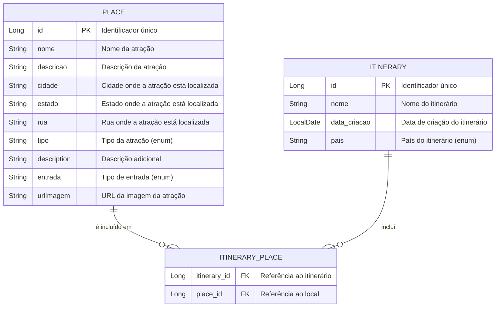

# 🌍 VisitMap

**VisitMap** é uma aplicação desenvolvida em Spring Boot e Thymeleaf que permite aos usuários planejar e explorar roteiros turísticos de forma fácil e interativa. A aplicação oferece uma interface amigável para visualizar locais turísticos, suas informações e criar itinerários personalizados.

## 📚 Estrutura do Banco de Dados

A aplicação utiliza um modelo de banco de dados relacional para gerenciar as informações das locais turisticos, Itnerários e suas interações. Abaixo está o diagrama de Entidade e Relacionamento com as tabelas principais da estrutura do banco de dados:

---
## 🛤️ Rotas da Aplicação

### 🏠 Home (`index.html`)
- **Página Inicial**: `GET /`  
  Acesso à página inicial do VisitMap.

### 🗺️ Itinerários (`/itineraries`)
- **Listar Itinerários**: `GET /itineraries`  
- **Detalhes do Itinerário**: `GET /itineraries/{id}`  
- **Criar Novo Itinerário**: `GET /itineraries/new`  
- **Salvar Itinerário**: `POST /itineraries`  
- **Editar Itinerário**: `GET /itineraries/edit/{id}`  
- **Atualizar Itinerário**: `POST /itineraries/{id}`  
- **Deletar Itinerário**: `GET /itineraries/delete/{id}`  

### 🏛️ Lugares Turisticos (`/places`)
- **Listar Lugares**: `GET /places`  
- **Detalhes do Lugar**: `GET /places/{id}`  
- **Criar Novo Lugar**: `GET /places/new`  
- **Salvar Lugar**: `POST /places`  
- **Editar Lugar**: `GET /places/edit/{id}`  
- **Atualizar Lugar**: `POST /places/{id}`  
- **Deletar Lugar**: `GET /places/delete/{id}`  

---
## 🧪 Testes Unitários

A aplicação **VisitMap** inclui uma suíte de testes unitários que garante a qualidade e o funcionamento adequado dos serviços. Foram implementados testes para as classes `ItineraryService` e `PlaceService` utilizando **JUnit** e **Mockito**. 

No total, 12 testes foram executados com sucesso, confirmando que as funcionalidades principais estão funcionando conforme o esperado.

---

## Funcionalidades ✨

- **🗺️ Cadastro de Itinerários**: Crie itinerários com nomes, descrições e datas programadas.
- **🏛️ Gerenciamento de Atrações**: Adicione, edite e remova atrações turísticas, incluindo informações detalhadas como nome, cidade, endereço, tipo, custo de entrada, horário de funcionamento e imagens.
- **🔍 Exploração de Atrações**: Visualize todas as atrações disponíveis, filtrando por tipo e cidade.
- **⭐ Avaliações**: Classifique atrações turísticas e veja a média das avaliações de outros usuários.

## Tecnologias Utilizadas 🛠️

- **Spring Boot**: Framework para desenvolvimento de aplicações Java.
- **Thymeleaf**: Motor de templates para gerar páginas HTML dinâmicas.
- **Hibernate**: ORM para mapeamento objeto-relacional.
- **Oracle Database**: Banco de dados relacional utilizado para armazenar informações de itinerários e atrações turísticas.

