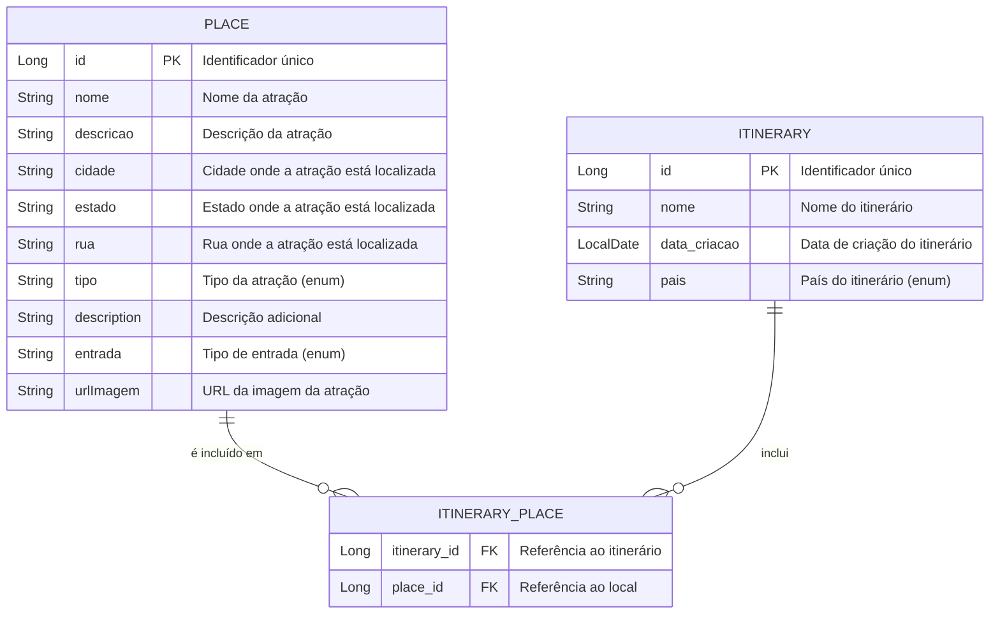

# 🌍 VisitMap

**VisitMap** é uma aplicação desenvolvida em Spring Boot e Thymeleaf que permite aos usuários planejar e explorar roteiros turísticos de forma fácil e interativa. A aplicação oferece uma interface amigável para visualizar locais turísticos, suas informações e criar itinerários personalizados.

## 📚 Estrutura do Banco de Dados

A aplicação utiliza um modelo de banco de dados relacional para gerenciar as informações dos locais turísticos, itinerários e suas interações. Abaixo está o diagrama de Entidade e Relacionamento com as tabelas principais da estrutura do banco de dados:



---

## 🛤️ Rotas da Aplicação

### 🏠 Home (`index.html`)
- **Página Inicial**: `GET /`  
  Acesso à página inicial do VisitMap.

### 🗺️ Itinerários (`/itineraries`)
- **Listar Itinerários**: `GET /itineraries`  
- **Detalhes do Itinerário**: `GET /itineraries/{id}`  
- **Criar Novo Itinerário**: `GET /itineraries/new`  
- **Salvar Itinerário**: `POST /itineraries`  
- **Editar Itinerário**: `GET /itineraries/edit/{id}`  
- **Atualizar Itinerário**: `POST /itineraries/{id}`  
- **Deletar Itinerário**: `GET /itineraries/delete/{id}`  

### 🏛️ Lugares Turisticos (`/places`)
- **Listar Lugares**: `GET /places`  
- **Detalhes do Lugar**: `GET /places/{id}`  
- **Criar Novo Lugar**: `GET /places/new`  
- **Salvar Lugar**: `POST /places`  
- **Editar Lugar**: `GET /places/edit/{id}`  
- **Atualizar Lugar**: `POST /places/{id}`  
- **Deletar Lugar**: `GET /places/delete/{id}`  

---

## 🧪 Testes Unitários

A aplicação **VisitMap** inclui uma suíte de testes unitários que garante a qualidade e o funcionamento adequado dos serviços. Foram implementados testes para as classes `ItineraryService` e `PlaceService` utilizando **JUnit** e **Mockito**. 

No total, 12 testes foram executados com sucesso, confirmando que as funcionalidades principais estão funcionando conforme o esperado.


---
## 🐳 Dockerfile Utilizado

A configuração do `Dockerfile` é essencial para preparar o ambiente de execução da aplicação, garantindo que todos os componentes necessários sejam incluídos na imagem Docker e que a aplicação seja executada de forma segura. Abaixo estão os detalhes de cada etapa do `Dockerfile` utilizado para o VisitMap:

```Dockerfile
# Use a imagem base do OpenJDK 17 com suporte ao Alpine Linux
FROM eclipse-temurin:17-jdk-alpine

# Instale o Maven para gerenciar dependências e compilar o projeto
RUN apk add --no-cache maven

# Defina o diretório de trabalho para a aplicação
WORKDIR /app

# Copie o arquivo de configuração do Maven para o diretório de trabalho
COPY pom.xml .

# Copie o código-fonte da aplicação para o diretório de trabalho
COPY src ./src

# Compile a aplicação com o Maven e gere o arquivo JAR
RUN mvn clean package

# Crie um usuário não privilegiado para executar a aplicação com segurança
RUN adduser -D appuser

# Altere a propriedade do arquivo JAR gerado para o usuário não privilegiado
RUN chown appuser:appuser target/VisitMap-0.0.1-SNAPSHOT.jar

# Altere para o usuário não privilegiado para evitar execução como root
USER appuser

# Exponha a porta 8080 para acesso à aplicação
EXPOSE 8080

# Defina o comando de entrada para iniciar a aplicação usando o JAR gerado
CMD ["java", "-jar", "target/VisitMap-0.0.1-SNAPSHOT.jar"]
```
---

## 🚀 Deploy e Integração Contínua - Azure Pipelines

O **VisitMap** utiliza uma abordagem automatizada para implantação e entrega contínua, aproveitando os recursos do **Azure Container Registry (ACR)**, do **Azure Web App for Containers** e do **Azure Container Instance (ACI)**. O pipeline de CI/CD é configurado para garantir que o processo de build, teste e deploy seja contínuo e integrado ao fluxo de desenvolvimento. 🌐🔧

### Passo a Passo para Configuração do CI/CD

1. **Criação do Repos do Azure DevOps** ☁️
   - Primeiramente, configure uma conta no **Azure DevOps** e crie um novo projeto para o **VisitMap**.
   - Importe o repositório do GitHub e crie as tasks necessárias para o pipeline.

2. **Criação da Infraestrutura no Azure** ☁️
   - Inicie configurando uma conta no **Azure Cloud**.
   - Utilize o **Azure CLI** para automatizar a criação da infraestrutura necessária para o seu projeto, garantindo que todos os recursos sejam provisionados de forma eficiente e padronizada.
   - Adicione uma conexão de serviço com o **Azure Container Registry (ACR)** e o **Web App for Containers**, que serão utilizados para hospedar a aplicação. 
   - O **Azure Container Instance (ACI)** também é uma excelente opção para testes e desenvolvimento. Ele fornece um ambiente leve e escalável, permitindo o desenvolvimento rápido de aplicações, ideal para cenários onde você precisa testar novas funcionalidades rapidamente sem a complexidade de um ambiente de produção completo.

3. **Configuração do Pipeline de Build (CI)** 🛠️
   - Crie um pipeline de build no **Azure Pipelines** para o repositório do projeto.
   - Use o arquivo YAML gerado a seguir para configurar o pipeline de build:

```yaml
# azure-pipelines.yml
trigger:
- main

pool:
  vmImage: ubuntu-latest

steps:
- task: Maven@4
  inputs:
    azureSubscription: '$(AzureSubscriptionID)'
    mavenPomFile: 'pom.xml'
    goals: 'clean package'
    options: '-DskipTests=false'
    publishJUnitResults: true
    testResultsFiles: '**/surefire-reports/TEST-*.xml'
    javaHomeOption: 'JDKVersion'
    jdkVersionOption: '1.17'
    mavenVersionOption: 'Default'
    mavenAuthenticateFeed: false
    effectivePomSkip: false
    sonarQubeRunAnalysis: false
- task: Docker@2
  inputs:
    containerRegistry: 'visitmaprm552258'
    repository: 'visitmap'
    command: 'buildAndPush'
    Dockerfile: '**/Dockerfile'
    tags: |
      $(Build.BuildId)
      latest
```

   - Esse pipeline executa os testes unitários com **JUnit**, constrói o pacote da aplicação e gera uma imagem Docker, que é enviada ao **Azure Container Registry**. 🐳 O **ACR** permite armazenar e gerenciar essas imagens de forma segura.

4. **Configuração do Pipeline de Release (CD)** 🚢
   - Crie um pipeline de release para automatizar o deploy.
   - Configure o pipeline para usar o artefato gerado no pipeline de build como origem.
   - Defina estágios de deploy para ambientes como **Desenvolvimento** (usando **Azure Container Instance - ACI**, que oferece um ambiente leve para testes e desenvolvimento) e **Produção** (usando **Azure Web App Service** para um ambiente robusto e escalável).

5. **Teste do Deploy Manual** 🧪
   - Realize um teste inicial do pipeline de release criando uma nova release manualmente.
   - Verifique se a aplicação é implantada corretamente e se todos os serviços estão funcionando como esperado. ✅ O ACI é útil para testar novas funcionalidades antes de serem promovidas para o ambiente de produção.
     
---

## Tecnologias Utilizadas 🛠️

- **Spring Boot**: Framework para desenvolvimento de aplicações Java.
- **Thymeleaf**: Motor de templates para gerar páginas HTML dinâmicas.
- **Hibernate**: ORM para mapeamento objeto-relacional.
- **Oracle Database**: Banco de dados relacional utilizado para armazenar informações de itinerários e atrações turísticas.
- **Azure DevOps**: Para configuração de pipelines de CI/CD.
- **Docker**: Utilizado para containerização da aplicação.

---

> Esse guia detalha o processo de configuração do CI/CD, desde a criação do projeto no Azure até a configuração do pipeline de build e release, facilitando a automação do deploy e a entrega contínua da aplicação VisitMap. ✨🚀
